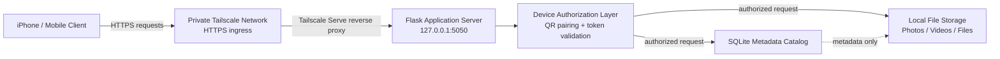

# HomeCloud

> **Your storage. Your cloud.**  
> A privacy-first personal cloud architecture that turns user-owned hardware into an authenticated, remotely accessible storage node.

HomeCloud is a self-hosted personal cloud system designed around a simple constraint: **the user's files remain on the user's own hardware**.

Instead of uploading personal photos and documents into a third-party storage pool, HomeCloud runs a local Python/Flask service on a Mac, stores the real file bytes directly on disk, persists structured metadata in SQLite, authorizes individual devices through one-time QR pairing, and exposes remote access through a private Tailscale HTTPS overlay rather than public port-forwarding.

The project started as a single phone-to-laptop upload path and has been incrementally evolved into a multi-layer storage, metadata, authentication, PWA, and private-network system.

---

## System architecture



### Storage model

HomeCloud deliberately separates **file bytes** from **file metadata**.

```text
Actual file bytes  ---> HomeCloudStorage/
Metadata catalog   ---> SQLite
Authorization      ---> paired-device token records
Remote transport   ---> private Tailscale HTTPS route
```

SQLite is the catalog, not the warehouse. Photos, videos, archives, and documents remain normal files on the host filesystem.

---

## Implemented engineering milestones

### Stage 1 — Local multipart file transport

Built the first end-to-end data path from an iPhone browser to a Mac-hosted Flask server.

- Multipart HTTP upload endpoint
- File-extension validation
- Maximum request-size enforcement
- Safe randomized storage filenames
- Mobile-responsive upload UI
- Upload progress reporting
- Local-network server health checks
- Direct persistence to user-owned disk

**Validated:** real iPhone photo -> Wi-Fi -> Flask -> Mac filesystem.

---

### Stage 2 — Cloud-style file management layer

Expanded the upload proof-of-concept into an interactive storage interface.

- Recent-file library
- Photo previews
- Video/document classification
- Download endpoints
- Delete workflow with confirmation
- Storage utilization reporting
- All / Photos / Videos / Files filtering
- Multi-format file handling
- Responsive mobile gallery

This transformed HomeCloud from a one-way transfer endpoint into a bidirectional file-management system.

---

### Stage 3 — Persistent metadata subsystem

Introduced SQLite as a durable metadata catalog instead of relying on directory enumeration as the application's memory model.

Each newly ingested object receives:

- Stable internal identifier
- Original client filename
- Randomized disk filename
- Exact byte length
- MIME type
- UTC creation timestamp
- Relative storage path
- File category
- SHA-256 cryptographic content fingerprint

Older pre-database files are automatically indexed during migration.

The application can therefore preserve user-facing filenames while maintaining safer internal storage identifiers.

---

### Stage 4 — Device authorization and revocation

Added a stateful device-pairing system so possession of the network address alone is insufficient for file access.

Pairing flow:

```text
Mac generates one-time secret
        ↓
Mac renders QR code
        ↓
Phone scans QR
        ↓
Server validates temporary secret
        ↓
Server issues random long-term device credential
        ↓
Only credential hash is persisted in SQLite
        ↓
Protected routes validate authorization
```

Implemented:

- Cryptographically random one-time pairing secrets
- Five-minute pairing expiration
- Single-use pairing semantics
- Random long-term device credentials
- SHA-256 token hashing at rest
- HttpOnly browser credential storage
- Protected upload/browse/download/delete routes
- Mac-only device administration
- Device last-seen tracking
- Immediate server-side device revocation

---

### Stage 5 — Install-like mobile application shell

Converted the mobile interface into an installable/app-like web experience.

- Web app manifest
- Dedicated HomeCloud application icon
- iPhone Home Screen metadata
- Standalone mobile layout
- Persistent bottom navigation
- Multi-file upload queue
- Mobile settings panel
- Service-worker architecture prepared for secure contexts
- Explicit no-store behavior for sensitive API/file responses

HomeCloud can be launched from the iPhone Home Screen while retaining the same backend and authorization model.

---

### Stage 6 — Private HTTPS remote-access architecture

HomeCloud's remote transport is being moved away from raw LAN exposure and into a private overlay network.

Implemented/configured:

- Flask bound to `127.0.0.1` instead of directly exposing the application server to the LAN
- Tailscale Serve as the remote reverse-proxy layer
- Private `*.ts.net` HTTPS endpoint
- No router port-forwarding
- No public Tailscale Funnel requirement
- Secure + HttpOnly paired-device cookies for the HTTPS route
- Separation between local Mac administration and proxied remote traffic
- Existing device-level HomeCloud authorization remains layered above the private network

Architecture:

```text
Remote iPhone
    ↓
Encrypted private Tailscale connection
    ↓
Tailscale Serve HTTPS endpoint
    ↓
localhost-only Flask process
    ↓
HomeCloud authorization
    ↓
SQLite + local filesystem
```

**Current validation state:** private HTTPS Serve transport has been configured; final off-LAN/cellular end-to-end validation is the active milestone.

---

## Security design

HomeCloud uses layered controls rather than treating one password as the entire security model.

| Layer | Purpose |
|---|---|
| Localhost-bound Flask server | Prevents direct remote access to the development server |
| Private overlay networking | Restricts remote routing to the user's Tailscale network |
| HTTPS ingress | Encrypts browser traffic to the private Serve endpoint |
| One-time QR pairing | Establishes initial device trust |
| Device token validation | Authorizes subsequent file operations |
| Hashed token storage | Avoids storing long-term device credentials in plaintext |
| Safe randomized filenames | Separates untrusted client filenames from disk identifiers |
| File validation | Restricts accepted upload types and request sizes |
| SHA-256 checksums | Records a deterministic content fingerprint |
| Route-level authorization | Protects browse/upload/download/delete operations |
| Revocation | Lets the Mac invalidate a previously paired device |

> **Important:** HomeCloud is an active engineering project, not a completed production security product. Remote access is intentionally being introduced through a private network rather than by exposing Flask directly to the public internet.

---

## Technology stack

### Backend
- Python
- Flask
- SQLite
- Werkzeug
- QR-code generation

### Frontend
- HTML
- CSS
- Vanilla JavaScript
- Responsive mobile UI
- PWA manifest / service-worker architecture

### Networking and security
- HTTP multipart transfer
- Token-based device authorization
- SHA-256 hashing
- Tailscale
- Tailscale Serve
- HTTPS private ingress

### Engineering
- Git / GitHub
- pytest
- Incremental migration strategy
- Local code backups before project-stage upgrades
- Separation of application logic, metadata, and stored binary objects

---

## Repository layout

```text
HomeCloud/
├── app.py
├── requirements.txt
├── README.md
├── .gitignore
│
├── homecloud/
│   ├── __init__.py
│   ├── config.py
│   ├── database.py
│   ├── routes.py
│   ├── security.py
│   └── storage.py
│
├── templates/
│   ├── index.html
│   ├── pair_phone.html
│   └── pair_setup.html
│
├── static/
│   ├── css/
│   ├── js/
│   ├── icons/
│   ├── manifest.webmanifest
│   └── service-worker.js
│
└── tests/
```

The following runtime/private data is intentionally excluded from version control:

```text
HomeCloudStorage/
HomeCloudData/
.venv/
_CodeBackups/
database files
tokens / keys
runtime network configuration
personal photos and documents
```

---

## Project philosophy

HomeCloud is built around five constraints:

1. **User-owned storage first** — the user's disk is the primary storage substrate.
2. **Metadata is not file storage** — database records describe files; they do not replace them.
3. **Authorization precedes remote exposure** — remote connectivity is added only after device-level access control exists.
4. **Private networking over public port exposure** — no random router port-forwarding for the Flask application.
5. **Incremental systems engineering** — every stage must produce a working, testable capability before the next abstraction layer is introduced.

---

## Roadmap

- [x] Phone -> laptop upload
- [x] Browse / download / delete
- [x] Storage metrics
- [x] SQLite metadata catalog
- [x] SHA-256 file fingerprints
- [x] One-time QR pairing
- [x] Long-term paired-device authorization
- [x] Device revocation
- [x] Install-like mobile/PWA shell
- [x] Multi-file uploads
- [x] Private Tailscale Serve HTTPS configuration
- [ ] Complete off-LAN/cellular remote validation
- [ ] macOS background service / automatic startup
- [ ] Retry queue and interrupted-transfer recovery
- [ ] Chunked large-file uploads
- [ ] Recycle-bin semantics
- [ ] Thumbnail pipeline
- [ ] Native iOS/Android client
- [ ] Background photo-backup queue
- [ ] Optional user-owned secondary mirror / backup target
- [ ] Product hardening and security review

---

## Why this project exists

Most cloud-storage systems abstract the storage hardware away from the user.

HomeCloud explores the inverse model:

> **Can a normal person's own computer behave like their private cloud without turning that computer into a publicly exposed server?**

The project combines client/server architecture, filesystem design, metadata modeling, authentication, cryptographic hashing, private networking, responsive UI design, progressive-web-app concepts, and reliability engineering into one end-to-end system.

---

## Status

**Active development — Stage 6**

The core local storage system, metadata layer, paired-device authorization, mobile shell, and private HTTPS transport configuration are implemented. Remote off-LAN validation and automatic background service operation are the next major milestones.

---

## Disclaimer

HomeCloud is currently a personal engineering project and learning platform. It should not be represented as production-hardened storage software, a backup replacement, or a security-audited commercial cloud service.
